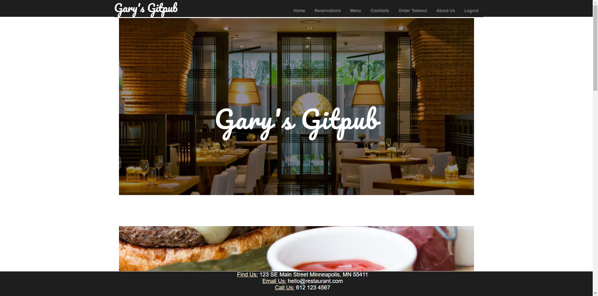
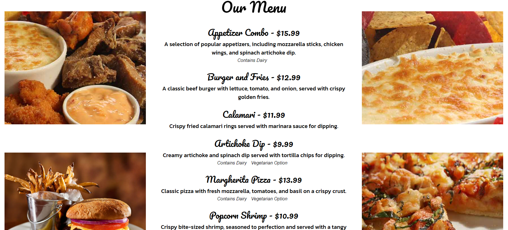

 # Gary's Gitpub Restaurant

## Description

Gary's Gitpub is a fully functional, interactive website designed for a fictional restaurant. This project was made to showcase our technical skills using various web technologies and coding languages. The website features both functionality for a regular user, such as someone making an order, and additionally has a manager view page which allows the manager to make menu alterations/changes, and a few other features. 

## Features
* Reservations: Make a reservation to the restaurant using date, time, table size, and an additional field for notes/special requests. Upon submission, the reservation can then be viewed by the manager.

* Menu: View the full menu of Gary's Gitpub which features detailed descriptions of each item, and includes information such as if the meal is vegetarian, dairy free, and gluten free.

* Cocktails: View the selection of cocktails that Gary's Gitpub has to offer.

* Order: Place orders directly through the website, which then redirects the user to a thank you page

* About Us: Learn more about Gary's Gitpub restaurant, and origin on the about us page.

* Login/Logout: You are able to create an account and login to the site to place your order.

* Manager view: A page only for manager's of Gary's Gitpub. This page has features such as editing/deleting the menu items, reservations, and customer data.

## Technical Details

The base of this project was HTML, CSS, Javascript, Express, Sequelize, and Handlebars. The NPM package 'NodeMailer' was used within the project to send the user an email upon placing a reservaton. 

## Table of Contents

- [Installation](#installation)
- [Usage](#usage)
- [Credits](#credits)
- [License](#license)

## Installation

This project is running off of Heroku and can be found at https://group-1-restaurant-manager-dc017dce6dee.herokuapp.com/

Interested in running the app locally instead? 

1. Clone the repository. First you must take the .env.example file and enter your MySQL username and password. Rename this file to just .env, and save. Run "`npm install`" within the console to install the dependencies required. 

2. Once that is done, you will need the database to be created and seeded. Assuming you have mysql, you are able to run "`mysql -u root -p`" and then type your password to start MySQL in the command line. You can then enter "`SOURCE ./db/schema.sql`" to create the database. 

3. Exit out of the MySQL terminal, and return to the command line. Run "`node seeds/`" to seed the created database. Once you have completed this, you can run node server.js to launch the website.

## Usage

Navigate to the link above to reach the homepage of the site.

In order to use all features of the site, you will need to create an account. Simply navigate to login within the navbar, and fill out the signup form on the right hand side of the screen.

Once logged in, the user can navigate in the navbar to reservations. Here you are able to make a reservation to the restaurant using date, time, table size, and an additional field for notes/special requests. Upon submission, the reservation is then saved into the database which can be viewed by the manager. A notification email will be sent to the logged in user's email address, confirming the reservation.

The menu page features Gary's Gitpubs entire menu. Each item features a name, price, description, and then optional columns of vegetarian, gluten free, and if the product contains dairy or not.

The order page allows the user to place a fictional order of anything on the menu. This page features everything the menu page has, except for item descriptions.

The user can select the quantity they want of each item, and each time this is done the order's subtotal adds up at the bottom of the page. Additionally the tax is listed directly below the subtotal which automatically calculates. Once the user is done ordering, they can optionally add a tip which then produces the final total cost of the order.
 

 

Upon placing the order, the user is redirected to a thank you page which lists the logged in users email, the placed order, timestamp the order was placed, and an estimation of when the order will be done.

If you wish to know more about Gary's Gitpub, visit the about us page.

## Credits

This project would not have been possible if not for the team working on it. Special thanks to 

- Andrew Helmin [AHelmin](https://github.com/AHelmin) 
- Jacob Maddaus [J-maddaus](https://github.com/J-maddaus) 
- Meredith Mcdonald [Ms-Meredith-McD](https://github.com/Ms-Meredith-McD)
- Riley Burns [RB2277](https://github.com/RB2277) 
- Tyler Peterson [tylerpeterson8791](https://github.com/tylerpeterson8791)  

Additional resources used:

Templateshub provided many files for the aesthetic of the site. This includes css preset files, js preset files, and food stock images.
https://www.templateshub.net/template/Elegant-Restaurant-Website

## License

This project is licensed under the MIT license. License link: https://opensource.org/licenses/mit/